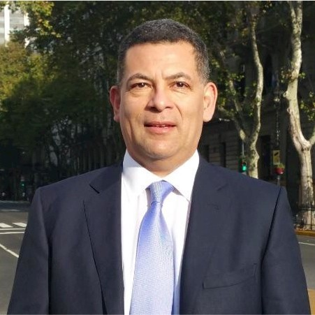

# Horacio Brizuela – International Professional Profile

  
  

**“Deep knowledge, clear teaching. Education that transforms.”**

---

## 🌐 Languages  
Looking for the Spanish version?  
👉 [Ver versión en español](https://github.com/FAMAphonic/cv-horacio-brizuela/tree/spanish)

---

## 🧭 Overview

Horacio Brizuela is an internationally experienced **AI modeller**, **digital transformation strategist**, and **university professor** with over 15 years of leadership in public administration, technology, and education.

He has led and advised national and international projects (World Bank, ESA, ARSAT, Ministries, universities), integrating deep technical knowledge with executive strategy, project design, and academic excellence.

---

## 🎯 Key Areas of Expertise

- 🤖 Artificial Intelligence and Deep Learning
- 📊 Business Administration, Finance & Control (MBA-level)
- 🧠 Higher Education, Psychopedagogy & Learning Innovation
- 🏛️ Public Sector Reform and Digital Transformation
- 🔬 Research in AI for Images, Text, and Scientific Data

---

## 📄 Download full CV (PDF)

[📎 Horacio_Brizuela_CV_2025.pdf](./Horacio_Brizuela_CV_2025.pdf)

Includes full work experience, education, academic projects, certifications, and references.

---

## 📬 Contact

- 📧 [horacio.brizuela@gmail.com](mailto:horacio.brizuela@gmail.com)  
- 📞 [+54 11 3375 4883](https://wa.me/541133754883)  
- 🌐 GitHub: [github.com/FAMAphonic](https://github.com/FAMAphonic)

---

## 🛡️ License

**Creative Commons Attribution – NonCommercial – NoDerivatives 4.0 International (CC BY-NC-ND 4.0)**  
🔗 https://creativecommons.org/licenses/by-nc-nd/4.0/

> Last update: **July 2025**
